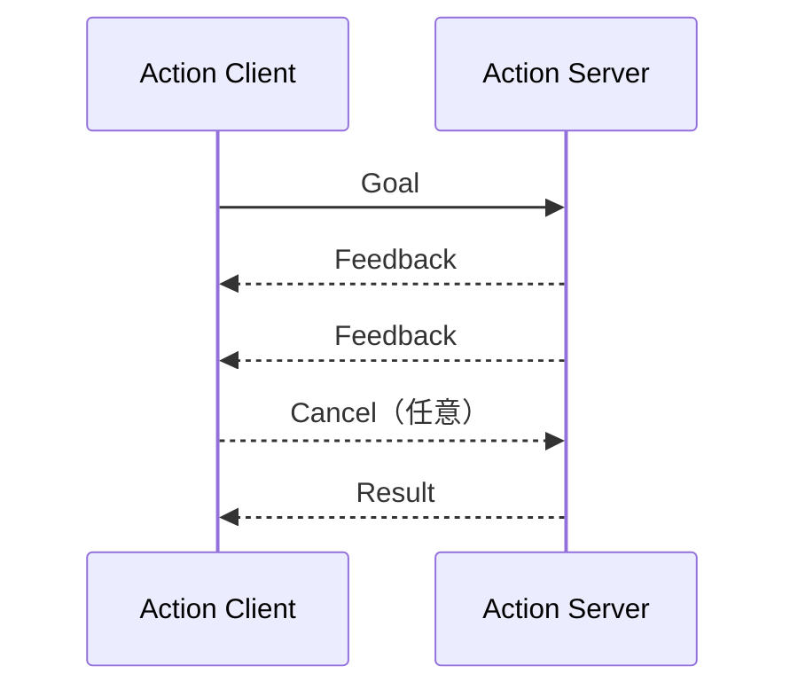

Actionは長時間処理を扱うための通信方式。Goal、Feedback、Resultで構成され、実行中キャンセルにも対応する。

## 主な用途

- ロボットアームの軌道実行
- 自律移動の目的地指示
- 長時間の認識処理
- 完了まで監視が必要な作業

## 構造

## Serviceとの違い

| 観点 | Service | Action |
|---|---|---|
| 処理時間 | 短い | 長い |
| 途中経過 | なし | Feedbackあり |
| キャンセル | なし | あり |
| 代表例 | 設定変更 | 軌道実行 |
