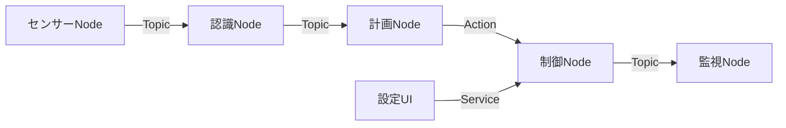

ROS 2は単一アプリケーションではなく、複数のNodeが通信してロボットシステムを構成するためのミドルウェアと開発基盤。

## 基本構成

## 通信方式の使い分け

| 方式 | 用途 | 例 |
|---|---|---|
| Topic | 継続的なデータ配信 | カメラ画像、Joint State |
| Service | 短時間の要求と応答 | 設定変更、状態取得 |
| Action | 時間のかかる処理 | ロボット移動、ナビゲーション |
| Parameter | Node設定値 | 周期、閾値、フレーム名 |

## ROS 2が提供するもの

- Node間通信
- Interface定義
- Discovery
- QoS制御
- Launch
- Logging
- Bag記録
- TF座標変換
- パッケージとビルドの仕組み
