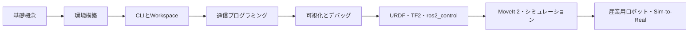

## 全体像

## フェーズ1：通信モデルを理解する

Node、Topic、Service、Action、Parameterの役割を区別する。最初からコードを暗記せず、どの通信方式を選ぶべきか説明できる状態を目標とする。

## フェーズ2：CLIで観察する

`ros2 node`、`ros2 topic`、`ros2 service`、`ros2 action`を使い、既存システムを観察する。ROS 2では、動作中システムをCLIから確認する力が重要。

## フェーズ3：PublisherとSubscriberを作る

PythonとC++で最小Nodeを作成し、パッケージ構成、依存関係、ビルド、実行を一連で理解する。

## フェーズ4：ロボットモデルへ進む

URDF、TF2、ros2_controlを学び、Joint、Link、Controller、Robot State Publisherの関係を整理する。

## フェーズ5：産業用ロボットへ展開する

MoveIt 2、Isaac Sim、cuRobo、FANUC ROS 2 Driverを、軌道生成・実行・フィードバック・安全制約の観点で統合する。
